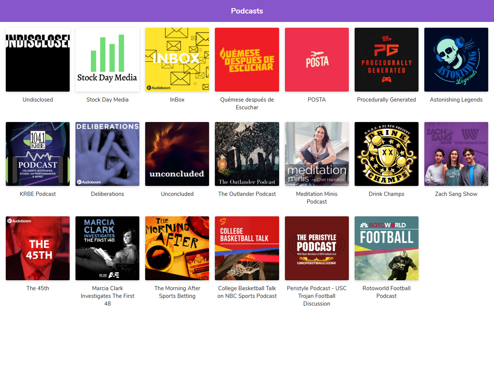
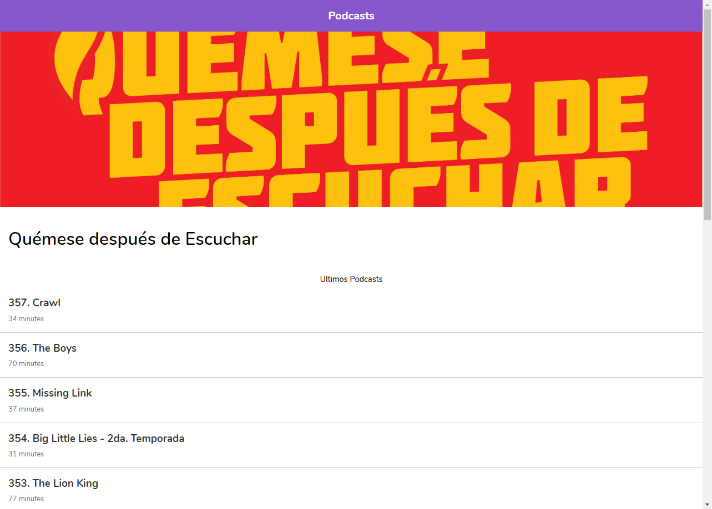

# App de Podcast Platzi

App de podcast desarrollada con Next.JS integrada con la API de AudioBoom 

<<<<<<< HEAD

=======

>>>>>>> dde7655422e9e1bc43581a1a0543f5c558a9c903

## ¿Cómo funciona?

Requiere Node.JS 10

* `npm install` para instalar dependencias
* `npm run dev` para el entorno de desarrollo
* `npm run build && npm start` para el entorno de producción

##Lincencia

MIT

